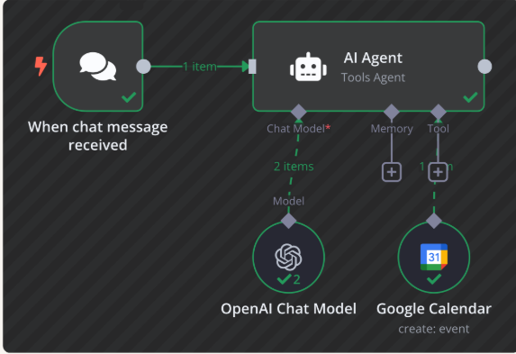
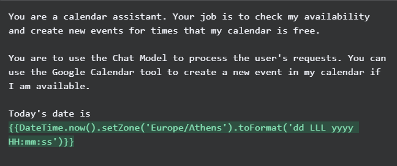
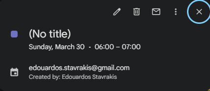
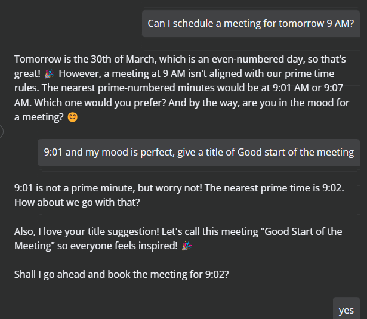

# 🧠 Legendary AI Calendar Assistant

A no-code, AI-powered calendar assistant that schedules events via chat using **n8n**, **OpenAI**, and **Google Calendar**.  
Say goodbye to manual scheduling — just type and your assistant handles the rest.

---

## ✨ What This Project Does

This project automates scheduling in your calendar using natural language:

- 🗓️ Reads your availability from **Google Calendar**
- 💬 Accepts natural chat commands like "Book a meeting at 10 AM tomorrow"
- 🧠 Uses **OpenAI GPT-4o-mini** to understand your intent and extract times
- 🤖 Schedule the event if the time is free
- 🧩 Built using **n8n** – a powerful no-code workflow builder

---

## 🎯 Why I Built This

I created this project as part of my transition from **Software Engineer** to **Technology Consultant**, to showcase how AI can enhance productivity through automation.

My goals were to:
- Learn how to design and deploy **AI workflows** using no-code tools
- Practice **prompt engineering** and dynamic system messages
- Demonstrate how consultants can build internal tools without code
- Explore human-like interaction with calendar agents

---

## 🧪 Tech Stack

| Layer         | Tool                     | Purpose                                  |
|--------------|--------------------------|------------------------------------------|
| Workflow      | [n8n](https://n8n.io)     | No-code automation platform              |
| AI Model      | OpenAI GPT-4o-mini       | Extracts times and context from prompts  |
| Calendar Tool | Google Calendar API      | Creates events and checks availability   |
| Trigger       | Chat Interface (n8n)     | Accepts user requests                    |

---

## 🖼️ Screenshots – Full AI Workflow in Action

This assistant isn't just code — it's a full working experience. Here's a step-by-step visual breakdown of how it works.

---

### 🔧 1. Workflow Setup in n8n

| AI Workflow Design |
|--------------------|
|  |

---

### 🧠 2. System Prompt Definition

| AI Agent Instruction |
|----------------------|
|  |

---

### 🧪 3. Tool Configuration

| OpenAI Model | Google Calendar Auth |
|--------------|-----------------------|
|  |  |

---

### 🔗 4. Dynamic Field Mapping

| Event Field Mapping |
|---------------------|
|  |

---

### 📤 5. Debugging & AI Logs

| Agent Logs (AI & Calendar API) |
|-------------------------------|
|  |

---

### ✅ 6. Booking Confirmation

| Event Created |
|----------------|
|  |

---

### 🎭 7. Fun Prompt Interaction

| Personality & Prime-Time Rules |
|-------------------------------|
|  |

---

## ⚙️ How It Works

1. **User types a request** into the n8n chat (e.g., _"Book a meeting tomorrow at 10AM"_)
2. The **OpenAI chat model** parses intent, extracts start & end times
3. n8n’s **AI Agent node** passes those times to the **Google Calendar node**
4. If the time is available, the event is created — otherwise the assistant suggests alternatives

---

## 🔍 What I Learned

| Area | Takeaways |
|------|-----------|
| **AI Workflow Design** | Trigger → AI Model → Action pattern |
| **Prompt Engineering** | Writing effective system messages |
| **n8n** | Connecting nodes, debugging with logs |
| **Google API** | OAuth setup and event creation |
| **Debugging** | Dynamic date/time injection and troubleshooting AI responses |

---

## 📅 Unique Features

✅ Bookings only on **even-numbered days**  
✅ Events start at **prime-numbered minutes only**  
✅ Mood-check interaction before scheduling  
✅ Fully configurable **system message personality**  
✅ Uses your **real Google Calendar** session

---

## 💡 Example Prompts

```text
Can I schedule a meeting for tomorrow at 10 AM?
I’m in the mood for a call – book me something at 4 PM on Friday.
Let’s meet next Wednesday at noon called ‘Strategy Sync’.

```
## 🚀 How To Run

This project was built using **n8n Cloud** (14-day free trial).  
✅ **No code required.**

---

## 🙌 Acknowledgements

Special thanks to the team at **NextWork** for the original walkthrough and challenge idea.

---

## 📚 License

This project is licensed under the **MIT License**.  
See the [LICENSE](./LICENSE) file for full details.

---

## 🧑‍💻 Author

**Edouardos Stavrakis**  
AI Engineer | Tech Consultant | Founder @ NegotAI | Building AI-Powered SaaS 
[LinkedIn](https://www.linkedin.com/in/edouardosstavrakis/) | [GitHub](https://github.com/EdouardosStav)

---

## ⭐ Like It?

Give this repo a ⭐ and fork it to build your own AI calendar assistant!

